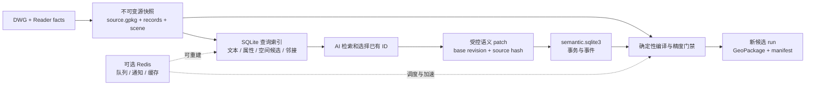

# CAD2GIS：AI、SQLite 与 Redis 的架构升级计划

日期：2026-09-05。审查基线：`main` / `3d3549776a6aa275e4076f1f25d18b1d22cdb164`。
状态：原始升级设计保留作基线；P0–P3 与 P4 的语义候选阶段已实施。实施范围、待完成的 canonical adapter 和 debug 后仿真证据见 [升级实施结果](ARCHITECTURE_UPGRADE_RESULT_2026-09-05.md)。配套文档：[debug_mcp 规范](DEBUG_MCP_SPEC_2026-09-05.md)。本文“当前 main”与第10节记录的是实施前审计，不代表升级后的工作分支。

## 1. 决策与优先级

当前最应升级的转换边界是：**不可变源事实快照 → 可索引的候选证据 → AI 语义修订 → 确定性编译**。

让 AI 在数据库中高效查找实体、文字、图例、关系及候选，并通过受控事务修改“解释与绑定”。源坐标、曲线参数、原始文字、原生长度、INSERT 变换链和 CRS/GCP 事实仍由确定性代码维护。模型读到数值不代表有权重写数值。

SQLite 是本地事实快照、查询索引、语义修订和审阅事件的存储基础；这些库的权威等级不同。Redis 适合作为未来多 worker 的队列、通知和可重建缓存，当前不应成为必需依赖，也不承担图纸事实或语义提交的最终权威。

实施顺序：身份与证据绑定修复 → 源快照独立边界 → 有界检索 → 语义事务与编译 → 精度/性能回归 → 按实测需要引入 Redis。

## 2. 当前 main 的真实结构

| 环节 | 当前 AI 权限及实现 | 证据位置 |
|---|---|---|
| 新图 onboarding | 模型选择图层/块/CRS 候选；编译项目配置并执行 dry run | `agent_mcp.py:393`；`cad2gis_v3/onboarding.py` |
| 标注族 | 当前还允许模型提供正则、0.1–100 的距离阈值、可选 source_layer；与文档“只选 ID”的承诺不完全一致 | `onboarding.py:530`、`:684`、`:798`、`:828` |
| Reader / plan domain | 提取源事实并生成实例视图；不是模型生成几何 | `cad2gis_v3/pipeline.py:1520`、`:1554` |
| 语义分类 | 主流程先运行 `classify_entities`，并非 AI 对数据库进行事务编辑 | `cad2gis_v3/pipeline.py:1652` |
| 证据查询 | 普通节点已走 SQLite；使用 `LIMIT/OFFSET`，并验证被选中节点的内容地址 | `evidence_index.py:189`；`agent_mcp.py:798` |
| 候选查询 | 标签读取两类全部节点；场景节点、端点/网络修复和创建 pack 部分仍加载整图 | `agent_mcp.py:598`、`:701`、`:956`、`:980`、`:1041` |
| 修订执行 | Decision Pack 绑定 source/graph，确定性模拟和独立校验后执行 | `repair_decisions.py`；`decision_executor.py:40` |
| 执行覆盖 | 可执行标签/样式及四种曲线/派生网络操作；`select_semantic_class`、`bind_existing_dimension` 注册了但未实现执行器 | `repair_decisions.py:50`；`decision_executor.py:40` |
| 产物发布 | `source.gpkg` 当前在后段 staged publication 中写入；已有 writer，缺独立源事实入口 | `cad2gis_v3/pipeline.py:2211`；`source_gpkg.py:612` |

main 公布 **33 个 MCP 工具**；没有 `export_source`、`prepare_semantic_batches`、`compile_semantic_layers`、`debug_mcp`。已安装连接器返回 capabilities v2 和 semantic compiler 信息，main 返回 v1；两者不能混作同一实现。先识别安装代码、工具 schema 与 checkout，再决定复用或迁移，不凭工具名称重建重复模块。

仓库自带技能的`agents/openai.yaml`要求v2，prompt reference标题也写v2，但该reference正文及runtime/skill要求v3；P0须一起修复，并将真实提示文件加入兼容性测试。

旧文档“SQLite is the local demo store”只描述 `review.sqlite3`。`warehouse.py` 是 GeoPackage 交付 writer，不是供 AI 执行 SQL 的通用数据仓库。

## 3. 数据权威与存储分工

| 数据 | 当前/拟议存储 | 定位与写权限 |
|---|---|---|
| 原 DWG / reader records | 原文件、内容绑定记录；原始 records 持久化契约需补齐 | 最高源证据；每条保留 source hash 与 reader provenance；不允许 AI 更改 |
| 原 CAD 坐标与属性 | 当前 `source.gpkg` | SQLite/GeoPackage 事实投影；不可等同于完整 DWG 二进制；不支持的实体保留状态及原始属性 |
| 块实例及 lineage | 拟独立的 source snapshot + scene index | raw definition 与 drawing-space instance 分开，保留精确矩阵和 lineage；计划声明不能修改 reader inventory |
| 转换后的证据关系 | `evidence.gpkg`、`evidence_graph.json.gz` | 某次 run 的不可变证据，不与源事实权威混同 |
| 检索加速 | 当前 `evidence_index.sqlite3`；扩展 pre-semantic scene index | 从指定 snapshot 可重建；丢失可以重建，错配必须拒绝；禁止把索引改写当作事实修改 |
| AI 已采纳语义修订 | 拟 `semantic.sqlite3` | 对指定 source snapshot 的版本化解释；class、label/dimension binding、派生关系引用；唯一事务提交入口 |
| 人工审阅与反馈 | 当前 `review.sqlite3`，可选 PostGIS | 独立 overlay，revision 与 events；不直接改 run GeoPackage，反馈需编译为新候选 |
| GIS 交付 | `delivery.gpkg` | 确定性生成、整体校验、原子发布；源几何与派生几何的区别必须显式可追溯 |
| 调度、缓存、通知 | 当前不依赖 Redis；将来按条件增加 | Redis 中只放任务 ID、状态投影、可重建查询结果和通知；最终提交结果在持久化账本 |

不要把所有 GeoPackage 合成一个可任意写的大库。源事实保持只读，语义库单独可写，索引可重建，发布产物不可变。SQLite 的事务能力不会自动赋予跨库/文件发布的原子性。

## 4. 第一个可交付切片

选一张现有基线图和一张未参与规则调优的验证图，完成以下闭环：

1. 独立提取 source snapshot，未知 CRS 记为未配准；无需为了保存原始 CAD 事实先猜测投影。
2. AI 查询“未绑定标注及其候选资产”，读取紧凑摘要，再按需批量展开证据。
3. 提交仅包含已有 label/feature/candidate/policy ID 的绑定修订，校验源 hash、候选有效性及基础 revision。
4. 确定性编译复制源文字和源几何；产出新候选 run。审查差异仅限预期语义绑定及其派生结果。
5. 原始坐标、曲线参数、长度及 lineage 指纹保持一致；冲突、失败、取消均不产生半提交。

第一切片复用已有 `attach_existing_label` 能力，不同时扩大几何执行权限。此后以同一协议扩展 `select_semantic_class` 和 `bind_existing_dimension`；每个操作单独声明执行状态和所需校验器。

## 5. 有界数据库检索契约

拟新增/扩展的接口名称属于设计，不是当前可调用工具：

| 接口 | 受控输入 | 有界输出 |
|---|---|---|
| `query_source_entities` | snapshot、图层/类型/终态、text query、region ID、cursor、projection | 摘要页、source/index hash、耗时、next cursor |
| `get_entity_context_batch` | 已观测 entity IDs、允许的字段集合 | 源事实、lineage、局部图关系；超预算返回 continuation |
| `query_relationship_candidates` | entity IDs、注册 relation kind、policy ID | 候选 ID、准确/近邻关系类型、证据与冲突原因 |
| `preview_semantic_patch` | source/index/ontology/policy hash、base revision、ID级操作 | 验证结果、影响集合、前后摘要及精度校验要求 |
| `commit_semantic_patch` | 已验证 preview hash、expected revision、idempotency key | revision、event ID、patch hash、实际影响行数 |
| `compile_semantic_revision` | 已提交 revision、snapshot ID、compiler/policy version | 新候选 run；不可覆盖接受的旧 run |

默认 50 行、最多 200 行，与现有节点页保持一致；批量上下文另设总字节预算（起始目标 64 KiB，配置化），单实体过大时分事实组返回，不能截断关键事实后声称完整。token 数如不能用对应模型 tokenizer 实测，就仅报告 bytes。

采用 `(snapshot_hash, filter_hash, last_position)` 的 keyset cursor，避免深页 OFFSET；过滤器与 snapshot 变化即 cursor 失效。建立稳定列索引：layer/type/layout/terminal state；边表增加 source/target 索引。标签候选按局部邻域提前物化，候选版本绑定数据与算法。

FTS5 用于原文检索；对中文、CAD 编号、标点和多语言标签分别评估召回。RTree 只筛选 bbox 候选，最终距离、相交与精度判定使用权威双精度/原生曲线数据。不能把 RTree 的近似边界写回源坐标。依据：[SQLite FTS5](https://sqlite.org/fts5.html)、[RTree精度与候选查询](https://sqlite.org/rtree.html)。

AI 默认调用结构化查询而非任意 SQL。确有专家 SQL 需求时，独立只读受限入口：只读连接、表/列白名单、参数绑定、authorizer、progress handler、时间/行数/字节上限、禁止 ATTACH/DDL/扩展加载和多语句。不能用“字符串以 SELECT 开头”代替权限控制。

## 6. 语义库与提交协议

最小 schema 建议：`source_bindings`、`semantic_revisions`、`semantic_patches`、`entity_decisions`、`label_bindings`、`derived_relations`、`operation_events`、`compile_jobs`、`outbox`。以 source/instance 稳定键引用源事实，跨库关联由服务验证，不声称存在跨库外键保证。

写事务：`BEGIN IMMEDIATE` → 在同一事务中读取当前 revision → 校验 expected revision 与 source/ontology/policy hash → 校验整批 ID/候选/基数约束 → 写解释、事件和 outbox → revision CAS → COMMIT。任一失败整批回滚。幂等键带唯一约束；同键同 payload 返回原结果，同键异 payload 报冲突。

模型请求、几何计算、GDAL 生成和网络访问均在写事务外。SQLite 每连接启用所需 foreign keys / busy timeout；本地可变语义库采用 WAL，事务保持短，并按耐久性要求固定synchronous策略。不可变源库/索引使用只读连接，不为交付文件盲目启用 WAL。依据：[SQLite事务](https://sqlite.org/lang_transaction.html)、[WAL并发及网络文件系统限制](https://sqlite.org/wal.html)。

编译采用持久化状态机：`queued → running → validated → published`，另有 `failed/cancelled`。staged 文件落盘、关闭数据库并校验后，发布唯一的新 run 目录，再登记完成；崩溃重启通过 manifest/hash 进行 reconciliation。禁止用多个数据库各自 COMMIT 冒充全局原子提交。

worker只生成唯一候选目录。目录存在或manifest完整不表示被业务接受：登记job结果必须在数据库事务中检查generation并CAS写唯一`result_run_id`；提升到接受状态时，再检查既定promotion authority并CAS更新`accepted_run_id`。旧worker在文件生成前做过检查仍不够，提交时必须重新验证。崩溃遗留的孤立候选保留待核验，恢复过程不得自动认作已接受run。

语义终态另设独立账本，例如 consumed/reference/documentation/unresolved，不能替换现有 reader 的 accepted/unsupported/abstained/error 账本；两层分别守恒，保留一对多实例展开及 feature lineage。未提交的实体默认 unresolved，不能为了覆盖率强行分类。

## 7. Redis 的定位与采用条件

当前依赖、生产代码和配置未发现Redis集成。先保持单机 SQLite + 本地 worker。只有出现多个独立 worker、需要跨进程/主机任务认领或实时通知、重复检索确有成本证据时，才增加可选 Redis adapter。

| 用途 | 是否适合 | 必须保留的正确性机制 |
|---|---|---|
| 重复查询/候选摘要缓存 | 适合 | key 含 source/snapshot、index、schema、policy、filters、revision；TTL/eviction/miss 可回退 SQLite |
| 长任务队列 | 多 worker 时适合 Redis Streams | durable job ID/outbox、幂等消费、pending recovery、完成后 ACK；不能假定 exactly once |
| UI 进度 | 适合 | Pub/Sub 丢消息可接受；客户端断线后从持久化 jobs/events 补状态 |
| 任务租约 | 可用于协调 | TTL 到期不等于旧 worker 停止；以持久化 generation/fencing 和状态 CAS 拒绝旧 worker 发布 |
| Source、最终语义 revision、精度证明 | 不适合只存在 Redis | 必须在源快照、语义事务库、manifest 中保留，可重放和审计 |
| SQLite 多写者/跨主机共享文件问题 | 不能解决 | Redis 锁不能把共享网络 SQLite 变成可靠数据库服务 |

推荐任务路径：SQLite 事务提交 job + outbox → relay 投递 Redis Stream（允许重复）→ worker 认领 job → 运行确定性编译 → 持久化发布结果 → ACK。Redis 崩溃、清空或消息重复不得产生第二个已接受 run 或丢失语义修订。幂等键绑定 source + revision + compiler + policy + runtime；不能只用 DWG 文件名。

outbox的“已发送”不代表job完成。启动及周期性reconciliation扫描持久化非终态jobs；没有有效租约且仍可重试的任务重新投递。这样即使relay标记已发送后Redis清空、消息不再存在于PEL，也能从任务账本恢复；已完成任务重复到达时返回原结果并ACK。验收必须覆盖这个丢消息窗口。

Streams的pending/claim/ACK用于重投与确认，worker仍需业务幂等；Pub/Sub是可能漏消息的临时通知。依据：[XREADGROUP](https://redis.io/docs/latest/commands/xreadgroup/)、[XACK](https://redis.io/docs/latest/commands/xack/)、[Pub/Sub](https://redis.io/docs/latest/develop/pubsub/)。

若业务真正发展为多主机共享可变状态，需选择中央事务数据库/服务（可评估 PostgreSQL），而非让多个主机直接写一个 SQLite 文件。GeoPackage 仍保留为交换/交付格式；每个编译任务可使用本地不可变副本。

RDB/AOF 是 Redis 自身恢复策略，不能替代业务事件账本。交付文件和大图 JSON 不放进 Redis；缓存只存紧凑摘要或 artifact 引用。服务中断时可暂停调度或退回明确配置的本地模式，但绝不能误报编译成功。

队列和可淘汰缓存建议分实例或清楚隔离容量/淘汰策略；队列满载要背压而非悄悄丢任务。锁只是协调机制，最终发布仍验证持久化revision/generation。依据：[Redis持久化](https://redis.io/docs/latest/operate/oss_and_stack/management/persistence/)、[Eviction](https://redis.io/docs/latest/develop/reference/eviction/)、[分布式锁限制](https://redis.io/docs/latest/develop/clients/patterns/distributed-locks/)。

当前`stage_contract.py:50`明确所有receipt均`cacheable=false`、`disabled_receipt_only`。Redis不得把reserved `cache_key`直接变成转换结果复用授权；阶段结果缓存须另行证明全部外部输入、实现/runtime、side effects及发布产物的依赖闭包。首期只缓存可重建查询摘要。

## 8. 分阶段工作包与验收

| 顺序 | 改动责任边界 | 产出 | 验收门槛 |
|---|---|---|---|
| P0 | `contracts.py`、`agent_mcp.py`、`evidence_index.py`、onboarding contract | main/安装身份对齐；索引 provenance fail-closed；策略越界纠正 | 缺失/损坏manifest、错误graph、过期cursor均拒绝；工具标明 executable/quarantined |
| P1 | `pipeline.py`、`source_gpkg.py`、reader/plan-domain facade | 独立 source snapshot + manifest；保留旧 convert入口 | 无CRS仍能保存原坐标事实；未知单位明确；中途失败保留审计证据且不伪造完整快照 |
| P2 | 扩展 `evidence_index.py`，新增 scene/candidate query service | keyset、批量读取、字段投影、局部关系/文本/空间检索 | 大图调用不解析完整JSON；每响应不超预算；索引重建与原查询语义等价 |
| P3 | 新 semantic store/patch service，扩展已有 decision executor | label绑定端到端闭环、revision CAS、幂等、审计outbox | 两并发同revision只接受一个；重复提交不新增事件；源事实指纹不变；故障整批回滚 |
| P4 | compiler adapter、verification、regression corpus | 扩展class/dimension能力；新run发布与精度报告 | 老图精确回归；新图独立人工truth；取消/崩溃重试不半发布；未支持操作保持隔离 |
| P5（按需） | job/outbox + 可选 Redis adapter | Streams队列、进度、摘要缓存 | Redis断开/重启/淘汰/重复投递/租约过期不改变业务正确性 |

P0 与 debug 规范落地先行。P1–P3按依赖推进；P2的查询服务可以在P1快照契约固定后独立开发。先审计已安装semantic compiler代码来源与测试，再决定挑选迁移范围，不直接把插件目录当main发布产物。

## 9. 精度与效率验收口径

- 源保真：原始坐标、原生曲线参数、native_length、文字/样式事实、实体键、嵌套变换和 lineage 独立 fingerprint；默认语义修改要求全部不变。
- 几何保真：未受影响 feature 的 WKB 与字段精确相等；受影响派生几何按现有版本化 materialization policy 检查，保留误差预算、坐标单位和几何 lineage。
- 实体能力：当前Feature/native_points和交付writer主要是二维路径；curve_facts另保留三维顶点信息并对部分非平面曲线设门禁。3D/Z/M、样条和非均匀块变换按实体类型建立支持矩阵，不能承诺已有GeoPackage输出无损覆盖全部CAD表达。
- 长度：原生弧长、交付弦长、投影网格长度、测地长度、DIMENSION 标注量分别保存，不能互相覆盖。
- 拓扑：端点相等和仅邻近分开；derived network 可增连边，但不挪源顶点，不溶解源线段来“修齐”。
- 完整性：reader、实例展开、语义终态、源segment与交付segment分别做守恒；unsupported/unresolved 不计为成功分类。
- 位置精度：未配准/名义CRS/实测GCP与独立检查点分别报告；没有外部真值，不声称绝对位置精度达到厘米级。

性能先记录现状，再设改进门槛。建议固定1万/10万/100万实体合成集，加现有基线及独立验证图；记录冷启动、热查询P50/P95、页深、返回bytes、行数、Python反序列化节点数、RSS、数据库锁等待和每次有效决策的工具调用量。

起始工程目标（尚未实测达成）：固定硬件10万实体下热查询50行P95≤200ms；单次紧凑上下文≤64KiB；同一标注任务的工具往返/返回bytes相对现有逐节点方案减少≥50%；发布前源事实差异为0。冷索引构建与首次hash校验单列，不藏入热查询成绩。任何速度提升都必须通过原有几何/语义等价验证。

容器完整性与几何保真分别验收；GeoPackage核心/非线性扩展及目标GIS兼容性以[GeoPackage 1.4.0](https://www.geopackage.org/spec140/)为固定依据。

## 10. 本轮证据与限制

已执行 GitHub main 的 `pull --ff-only`；原 feature checkout 与未跟踪文件保留。没有修改生产源码、原图、已有run或已安装插件。

已跑10个定向测试文件，共86 passed（主集69，onboarding/review补集17）；覆盖 evidence index、MCP stdio、Decision Pack、warehouse事务、source GeoPackage、stage contracts、terminal accounting、delivery equivalence、onboarding与review。实测stdio协商协议为2025-11-25，SDK为1.29.1，33个工具，越界路径返回错误。doctor报告ready；这不等同真实DWG全流程或跨CAD绝对精度已验证。

证据目录：`E:/branch_CAD2GIS/validation/architecture-audit-20260905/`。三路检索使用GitHub、Exa、Tavily；再将源码、运行/测试、官方规范相互核对。三搜索渠道命中同一官方页面只算同一个技术依据，不能当成三个独立实验。

正式代码审查结果、增补测试与上游引用见同目录 `code-review/`、`architecture-evidence.md`、`official-sources.md`；综合结论见 [审查记录](AI_DATABASE_REVIEW_2026-09-05.md)。
