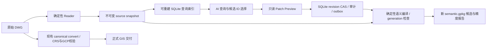

# AI 数据库架构升级：实施、debug 与仿真结果

日期：2026-09-05。工作目录：`E:/branch_CAD2GIS/CAD2GIS-main`。分支：`codex/ai-database-architecture-upgrade`。
基线：GitHub main `3d3549776a6aa275e4076f1f25d18b1d22cdb164`；package/plugin 升级到 **0.4.0**，通过上述独立分支交付，宿主已安装的插件保持原版本。

## 已交付的转换边界

本轮把“AI 高效查询数据库、受控修改语义、确定性生成候选”做成可执行闭环。AI 不持有任意 SQL 写入口；原图及源事实保持不可变。SQLite 承担快照、派生索引、语义 revision、jobs/events/outbox 的明确职责；Redis 保持可选、未引入服务或依赖。



语义候选与正式交付是两个明确阶段。当前 `semantic_features` 引用精确源实体和源几何，不新建第二份几何权威。实例 `view=plan` 已能检索原生变换及 lineage；当前 patch 接受源实体键。将实例级语义 revision 接入 canonical materialization、CRS/GCP 和交付接受流程，仍需要后续 adapter 与独立真值验收；没有自动提升 `accepted_run_id`。

| 工作包 | 实施内容 | 状态 |
|---|---|---|
| P0 | graph/index/source/manifest 严格绑定；Windows 校验缓存失效；onboarding v2 只选候选/策略 ID；prompt v3 对齐 | 完成 |
| P1 | 独立 `export_source`，原子 source manifest，原始 reader JSONL、source.gpkg、场景及 plan 实例事实 | 完成 |
| P2 | source/plan SQL 模板、keyset、投影、中文检索、批量分块、曲线空间候选、取消与预算 | 完成 |
| P3 | ID-only patch、preview、revision CAS、整批拒绝、幂等、events/outbox、只读状态恢复 | 完成 |
| P4 | class/label/真实 DIMENSION 候选与语义候选编译；持久化 jobs、取消、generation、崩溃恢复和精度门禁 | 候选阶段完成；canonical adapter/人工真值待后续 |
| P5 | 多 worker Redis adapter | 按计划保持可选，当前未实施、未宣称 Redis 宕机测试通过 |

新增 MCP 工具包括 `export_source`、`query_source_entities`、`get_entity_context_batch`、`prepare_semantic_batches`、`query_relationship_candidates`、`initialize_semantic_store`、`preview_semantic_patch`、`commit_semantic_patch`、`compile_semantic_revision`、`inspect_semantic_store`、`cancel_compile_job`、`reconcile_compile_jobs` 和 `debug_mcp`。总数从 33 增到 **46**。

## Debug 修复与独立审查

先执行定向 debug，再运行各模块仿真；审查发现问题后重新执行受影响测试及仿真。独立 code review 发现并推动修复：

1. Windows 的 `stat.ctime` 是创建时间，同长度修改并恢复 mtime 会使旧校验缓存失效判断错误。现在读取内核 ChangeTime；无法读取时禁用该次缓存命中，重新验证。
2. 顶点包围盒会漏检 bulge 圆弧中段。现在使用解析极值/保守曲线包络，处理实例 affine 变换，无法可靠界定的曲线显式作为 unbounded candidate；索引 schema 升为 v2。空间命中仍是候选，不冒称精确相交。
3. 仅比较 `source_*` 表会漏掉 CRS 注册被改变。精度 fingerprint 扩大到原快照全部非 semantic 表及 schema，覆盖 GeoPackage SRS、几何注册及 RTree。
4. 真正的 MCP 成功写调用原来仍记录 committed=unknown；现在成功返回持久化 receipt 时明确 committed=true，取消/异常下不确定的写仍返回 unknown。
5. debug 身份检查现在读取两份真实 plugin manifest 及 prompt 文件，而不只比较 Python 常量。

另修复 Windows SQLite 连接未关闭导致目录发布失败、只读句柄 fsync、候选分页临时排序，以及 stdio 会话内运行 Git 子进程可能卡在管道清理的问题。身份检查改为只读 HEAD/refs，并以源码文件内容指纹识别实际代码。新数据库工具通过 worker 线程执行，MCP 事件循环可以继续处理状态/取消请求；取消读查询传递 Event 至 SQL progress handler，写 RPC 取消后按原幂等键查持久化状态。

相关测试主集 **202 passed**，最终改动补集 **106 passed**；按 testcase 去重，共 **210 项全部通过**。Ruff F/E9 通过。该数量不是整个仓库所有测试数量。详见 [验证汇总](../../validation/architecture-upgrade-20260905/verification-summary.json)、[主集 JUnit](../../validation/architecture-upgrade-20260905/final-debug.xml)、[最终补集 JUnit](../../validation/architecture-upgrade-20260905/final-followup.xml) 和 [独立审查报告](../../validation/architecture-upgrade-20260905/code-review/architecture-upgrade-code-review.md)。

## Debug 后仿真结果

| 场景 | 数据和结果 | 精度/完整性边界 |
|---|---|---|
| 10 万实体 SQL 仿真 | 2,000 页返回 100,000 实体，无丢失或重复；最终代码热查询 P50 **20.72 ms**、P95 **30.73 ms**；最大页 **5,963 B**；50 实体上下文 **10,345 B** | 注入 records，使用真实 source export/GPKG/SQLite 实现；不代表原生 reader 精度 |
| 冷构建 | source export **290.42 s**，最终索引 **59.69 s / 460,132,352 B** | 冷构建和首次校验单列；未把它们隐藏进热查询指标 |
| 语义事务仿真 | 2,101 实体、15,403 候选、130 个 ID 操作；100 feature、其余 2,001 unresolved；候选查询 P95 **3.19 ms** | class/label/真实 DIMENSION 来源事实绑定；全部原快照表指纹相等；重复编译同一结果 |
| Kletek 原生 DWG | LibreDWG 0.14，1,538 源实体、1,072 plan 实体；3 个 GENERIC_ASSET 协议样本，其余 1,535 unresolved | 原图、所有源 artifact、源表及 CRS 元数据不变；reader accepted 1,491 / unsupported 47 |
| AGA-Al Baraka TR2 原生 DWG | LibreDWG 0.14，5,495 源实体、1,545 plan 实体；3 个协议样本，其余 5,492 unresolved | 原图及所有源事实不变；reader accepted 4,854 / unsupported 641 |
| Kletek 正式交付回归 | 基线 main 与升级代码分别执行原 canonical convert；**8 层、263 features 精确相等，差异图层 0** | 比较 schema、geometry BLOB、字段、标签、长度、lineage 与几何 CRS 注册；不证明测绘绝对精度 |
| 实际 MCP stdio | SDK 1.29.1，真实协商 **2025-11-25**，46 工具；身份/schema、版本漂移、越界路径、查询错误后恢复、8 KiB 协议预算通过 | 原生 stdout 为协议，trace 写 stderr；没有升级协议或隐式安装依赖 |

证据：[10 万实体](../../validation/architecture-upgrade-20260905/source/scale-100k/results.json)、[语义仿真](../../validation/architecture-upgrade-20260905/semantic/simulation-report.json)、[Kletek](../../validation/architecture-upgrade-20260905/real-dwg/kletek-v1/report.json)、[AGA](../../validation/architecture-upgrade-20260905/real-dwg/aga-v1/report.json)、[正式交付精确比较](../../validation/architecture-upgrade-20260905/canonical-delivery-equivalence.json)、[实际 MCP probe](../../validation/architecture-upgrade-20260905/stdio-final/report.json)。

真实图纸仿真采用有限、可重放的候选 ID 选择，没有调用付费模型，也没有独立人工行业标注或测量检查点。附近文字只作候选，没有仅按距离强制绑定。无 CRS 场景明确保存 native_cad_unregistered；不声称全 CAD 表达已无损 GIS 化或绝对精度达到厘米级。100 万实体、工具往返减少 ≥50%、多主机调度尚未验证。

## 使用与重放

在安装该 checkout 的 Python 环境执行；本机验证使用 `E:/branch_CAD2GIS/.venv-unified-upgrade/Scripts/python.exe`，`PYTHONPATH` 指向本仓库 `src`。

```text
python -m cad2gis debug-mcp --json
python -m cad2gis export-source drawing.dwg --run-dir runs/source-001 --json
python -m cad2gis query-source runs/source-001 --layer NETWORK --limit 50 --json
python -m cad2gis semantic prepare --source-run runs/source-001 --output-dir runs/prepare-001 --json
python -m cad2gis semantic init --source-run runs/source-001 --prepare-manifest runs/prepare-001/manifest.json --semantic-store runs/semantics.sqlite3 --json
python -m cad2gis semantic candidates --prepare-manifest runs/prepare-001/manifest.json --relation-kind class --json
```

按 init 返回的五个 binding hash、当前 base_revision 和候选构造 ID-only `patch.json`；`semantic preview/commit/compile/status/cancel/recover --help` 给出后续参数。必须保留同一幂等键处理未知结果。所有 source、prepare、candidate 目录互相独立，语义库不放入不可变输入目录。

可重放脚本：[debug_mcp_probe.py](../tools/debug_mcp_probe.py)、[simulate_source_queries.py](../tools/simulate_source_queries.py)、[simulate_real_dwg_architecture.py](../tools/simulate_real_dwg_architecture.py)。脚本要求新输出目录，防止覆盖既有证据。最初执行副本位于被仓库忽略的 scripts 目录，内容相同的受版本管理副本现位于 tools。

下一升级门槛：先做实例级语义到 canonical compiler 的显式 adapter，带 source/plan lineage、CRS/GCP、长度各口径和独立人工真值；再测量索引体积及百万实体冷构建成本。只有本地 worker 已成为瓶颈时引入 Redis Streams adapter，继续以 SQLite job/outbox/generation 为正确性权威。
